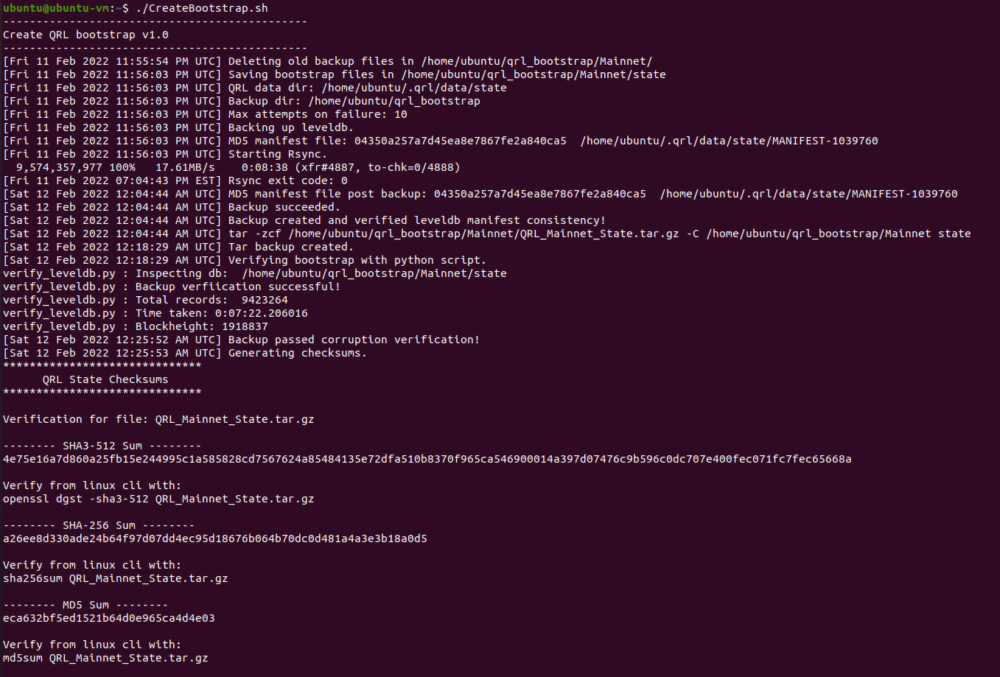

# Generate QRL bootstrap files with a live node

Bootstrap files can help to speed up the syncing process for anyone who wishes to run a full [QRL](https://www.theqrl.org/) node. Instead of fetching each block, these files allow a user to almost immediately have a functional QRL node up and running.

The [QRL blockchain](https://www.theqrl.org/) uses [LevelDB](https://github.com/google/leveldb) to store its information. Usually, to save the blockchain, DB must be closed and that means QRL's node need to be stopped. 

The aim of this project is to save QRL's blockchain data in a stable way while QRL node is running. 

## Requirements

Running a [QRL node](https://docs.theqrl.org/node/QRLnode/).

## Usage

1) Open a terminal and download the script. 

	    wget https://raw.githubusercontent.com/0xFF0/QRL_bootstrap/main/CreateQRLBootstrap.sh

2) Make the script executable.

	    chmod +x CreateQRLBootstrap.sh

3) Run the script each time you want to save bootstrap files. 

	    ./CreateQRLBootstrap.sh	

	

	  
	

4) Files generated are:

	- QRL_Mainnet_State.tar.gz
	- Mainnet_State_Checksums.txt
	- blockheight.txt

